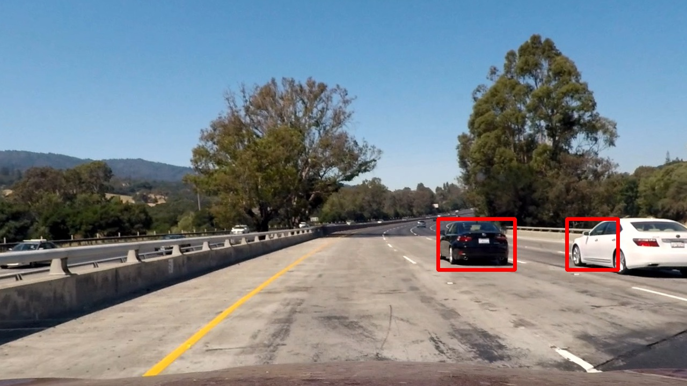
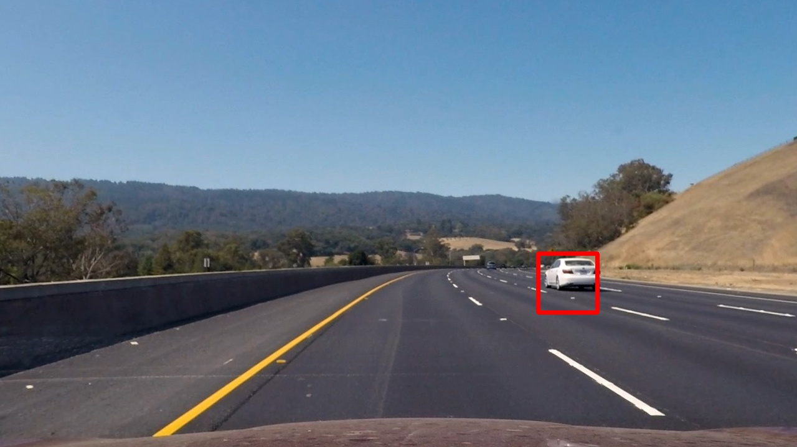
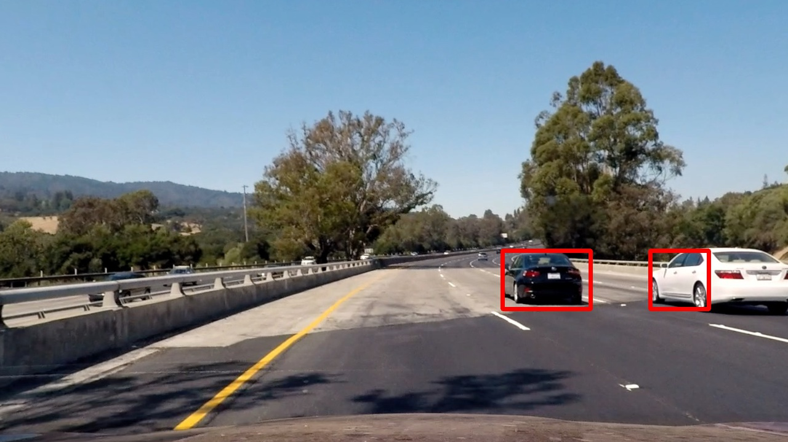
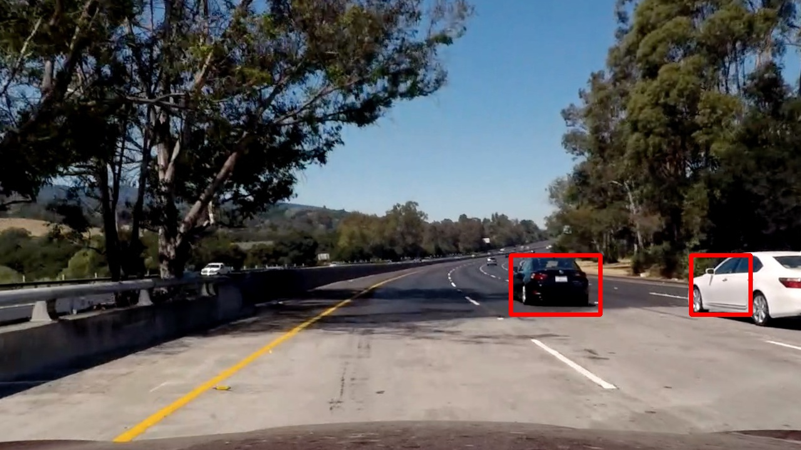
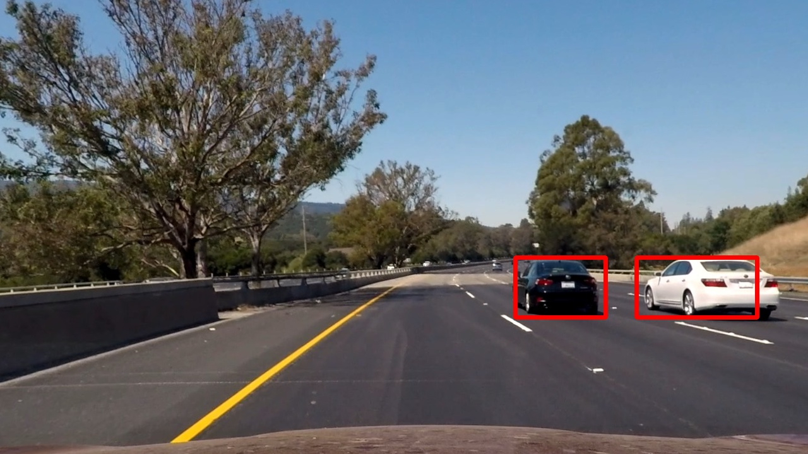

**Vehicle Detection Project**

The goals / steps of this project are the following:

* Perform a Histogram of Oriented Gradients (HOG) feature extraction on a labeled training set of images and train a classifier Linear SVM classifier
* Optionally, you can also apply a color transform and append binned color features, as well as histograms of color, to your HOG feature vector. 
* Note: for those first two steps don't forget to normalize your features and randomize a selection for training and testing.
* Implement a sliding-window technique and use your trained classifier to search for vehicles in images.
* Run your pipeline on a video stream (start with the test_video.mp4 and later implement on full project_video.mp4) and create a heat map of recurring detections frame by frame to reject outliers and follow detected vehicles.
* Estimate a bounding box for vehicles detected.

[//]: # (Image References)
[image1]: ./examples/car_not_car.png
[image2]: ./examples/HOG_example.jpg
[image3]: ./examples/sliding_windows.jpg
[image4]: ./examples/sliding_window.jpg
[image5]: ./examples/bboxes_and_heat.png
[image6]: ./examples/labels_map.png
[image7]: ./examples/output_bboxes.png
[video1]: ./project_video.mp4


### README

### HOG parameters
The hog features is got with the help of sci-learn kit, in `train.py`, the `got_hog_features` method.

I started by reading in all the `vehicle` and `non-vehicle` images.  Here is an example of one of each of the `vehicle` and `non-vehicle` classes, shown as follows:


And the parameter is on `pipe.py` insided method `pipeline` from #22 to #32. For the compute limitation of my computer, `pix per cell`  and `cell per block` should not be too big. For this project runs really slow in python. And the color space `YCrCb` is more powerful.
```python
    #parameter for features
    cspace = 'YCrCb' #color space
    spatial_size = (32,32) #spatial_size
    hist_bins = 32 #histogram bins
    orient = 9 # hog orient
    pix_per_cell = 8 
    cell_per_block = 2
    hog_channel = 'ALL' 
    spatial_feat = True
    hist_feat = True
    hog_feat = True
```


### Classifier trainning
I use a linear SVM classifier, and it's trained by the `vehicle` and `non-vehicle` datasets. The feature is scaled by `X_scaler = StandardScaler().fit(X)`. The dataset is shuffled and seperated into 80% `trainnning set` and 20% `test set`. The code is in `train.py` through line #109 to the end. The test accuracy is about 99%. 

```bash
Loaded Img
car images:8792, noncar images:8968
feturese extracted
72.5 Seconds to extract HOG features...
15.84 Seconds to train SVC...
Test Accuracy of SVC =  0.9924
My SVC predicts:  [ 1.  1.  0.  1.  1.  1.  1.  0.  0.  0.]
For these 10 labels:  [ 1.  1.  0.  1.  1.  1.  1.  0.  0.  0.]
0.00073 Seconds to predict 10 labels with SVC
```
---
### Sliding Window Search

#### window
For python is really slow in loop for me, especially two-level for loop in this case. I made a window list once, and search the 'window' in image by index. And the windowed image features is got by `single_img_features` and then predicted by the linear SVM classfier `svc` in `window.py` function `search_windows`.

#### improve accuracy	
I use heat map, sci-learn label and all the hog-channel to improve detectoin accuracy.
Here are some results.







---
### Video Implementation
Here's a [video](./video.avi)


---

### Discussion

This approach is really slow, and not stable. Some window is jumping. 

